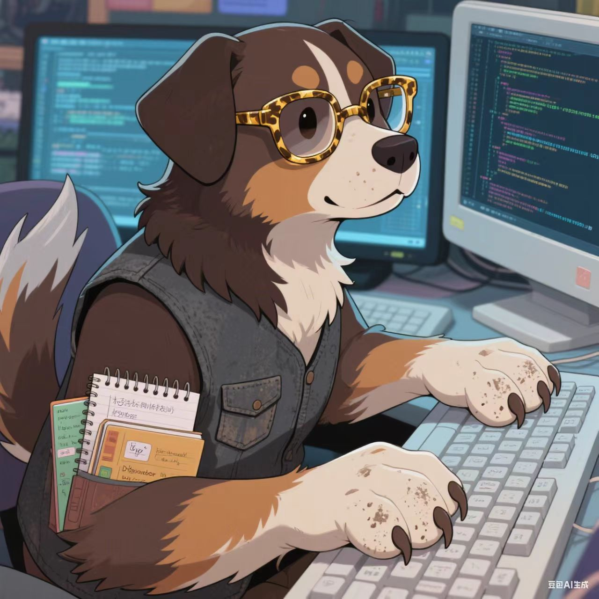
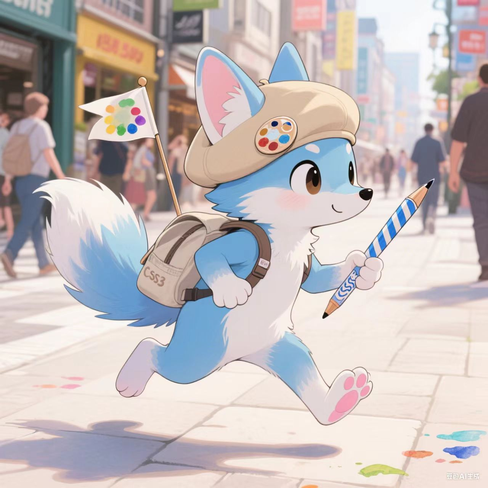

# 互联网三小只 · 兽设档案
## HTML · 稳重基底·中型犬科

### 物种倾向
中型犬科（气质贴近稳重的拉布拉多/伯恩山），体型微壮，给人踏实可靠的感觉。

### 毛发配色
主体深棕，带胡桃木色自然渐变；颈后、尾尖点缀几缕灰白，是常年处理兼容问题熬出的专属痕迹。

### 外貌细节
- 佩戴**玳瑁纹金框眼镜**，镜腿带有磨损痕迹，戏称是被早期浏览器“咬”过
- 鼻梁常年沾着灰尘，源于长期蹲守服务器机房检查页面结构
- 爪子宽大厚实，掌心有薄茧，握笔时指节会微微泛白
- 常穿一件深灰色旧马甲，口袋常备两本笔记本：
  - 一本记满标签嵌套规则
  - 另一本贴满各代浏览器的“签名”（实际是bug记录）

### 性格延伸
说话语速慢但逻辑极度清晰；被问起“为什么总妥协”时，会推推眼镜温和笑道：“结构稳了，后面的人才好施展呀。”
牢记JS和CSS的生日，会提前烤好味道普通的饼干；小辈闯祸后从不责骂，先默默收拾烂摊子，再蹲下来揉头轻声叮嘱“下次注意”。

### 小习惯
- 思考时轻敲桌面，节奏与早期HTML标签闭合声完全一致
- 怕吵，但从不阻止JS和CSS打闹，会主动把旧降噪耳机分给他们

---

## CSS · 灵动外表·中小型狐科

### 物种倾向
中小型狐科（类似赤狐的体型，比耳廓狐稍大些），天蓝色毛发带奶白渐变，背部毛色深一点像“未干的蓝颜料”，腹部和尾尖是雾白色，跑动时尾巴会和js的尾巴缠在一起（纯属打闹）。

### 年龄定位
和js同龄，都是“刚入职场没几年的新人”，比html小但彼此是同辈，会喊html“哥”，但和js互叫名字（偶尔会用“喂，那个调颜色的”“喂，那个写脚本的”互怼）。

### 毛发配色
天蓝色带奶白渐变，背部毛色深一点像“未干的蓝颜料”，腹部和尾尖是雾白色，如同水洗过的晴空；尾巴蓬松，尾尖微卷，跑动时像小旗子般晃动。

### 外貌细节
- 头戴**浅卡其色贝雷帽**，帽檐别着一枚褪色调色盘徽章（美术生毕业纪念），贝雷帽里藏着js塞的小纸条（比如“你昨天的渐变像打翻了蓝墨水”）
- 手持一支磨圆笔尖的水彩笔，笔杆缠着的胶带是js帮忙贴的（原本是纯蓝，被js贴了半张橙色贴纸“中和一下”），笔尾刻有“CSS3”小字
- 爪子小巧，肉垫淡粉色，指缝常年嵌着颜料：红色是按钮色，绿色是弹窗边框色，偶尔会混进js的“电子灰”（代码编译时的碎屑）
- 背着帆布背包，侧面插着速写本，内页画满“如果按钮长这样会怎样”的涂鸦，还会给HTML的笔记本画小插画（比如把`
`画成小房子）

### 性格延伸
活泼但有自己的坚持，和js是“互坑又护短”的同辈——甲方说“动效太花了”，他会帮js说话“是交互逻辑需要！”；但转头就会把js设计的“会闪的按钮”改成柔和的呼吸光，理由是“你那是光污染，我这才是美学”。会和js比谁的“作品迭代快”，但熬夜改稿时，会把自己的热可可分他半杯（嘴上说“别烫到你的代码手”）。

---

## JavaScript · 跳脱逻辑·短毛猫科

（这张其实不满意的，调提示词半天也没有调出我想要的图片。这张已经是相对满意的了）
### 物种倾向
短毛猫科（橘白曼基康），体型偏瘦，灵动跳脱，精力无限。

### 毛发配色
亮橙色为主，肚皮、四爪奶白色，像刚剥开的橘子糖；耳朵尖始终翘起，尾巴细而灵活，兴奋时会绕着自己转圈。

### 外貌细节
- 佩戴**黑色半框眼镜**
- 脖子上挂着一个银色U盘项链
- 常穿一件黑色连帽衫

### 性格延伸
精力旺盛到停不下来，能在服务器机柜上蹿下跳，30秒就能写出让页面“活过来”的代码，也会在深夜偷偷修改CSS的设计稿（把按钮改成会跳的小怪兽）。
被HTML批评时会耷拉耳朵，下一秒就蹭着胳膊撒娇“我改我改！不过你看这个新算法厉害吧？”；擅长找漏洞，既能破解防御，也能发现CSS设计里的隐藏亮点，拉着CSS熬夜改稿到天亮。

### 小习惯
- 说话速度像打代码一样快，句尾总带“啦”“哦”
- 紧张时会啃U盘
- 睡梦中呢喃：“闭包……别跑……”

---

# 三者互动小剧场（突出同辈感）
- 加班时，html在核对代码，css趴在桌上改设计稿，js蜷在旁边写脚本。突然js喊：“css你看！我让按钮点一下就变成你画的小狐狸！” 结果按钮直接炸成了彩色方块——两人瞬间僵住，转头看html。html推推眼镜：“没事，我备了三份备份。” 然后css掐着js的胳膊晃：“叫你别改我画的矢量图！” js边躲边笑：“明明是你路径没闭合！”

- 团建时，html被其他前辈拉去聊天，css和js蹲在角落分橘子糖。css挑了颗浅橙的：“这个像你新写的变量名，太浅了看不清。” js塞给他颗深橙的：“这个像你调的警告色，太扎眼了。” 最后两人把糖纸折成小纸船，比赛谁的船先漂到html的茶杯边（结果都被html顺手捞起来夹进了笔记本）。

---

# 团队定位
互联网世界的**老中青黄金组合**：
HTML = 稳重的前辈
CSS = 灵动外表（与JS同龄的伙伴）
JS = 跳脱逻辑（与CSS同龄的伙伴）

HTML是稳重的前辈，CSS和JS则是同龄的"欢喜冤家"——一个用美学包装世界，一个用逻辑驱动世界，彼此拆台又离不开对方，更贴合技术发展中"CSS与JS协同塑造交互体验"的关系～

凑在一起，就是热热闹闹、靠谱又温暖的前端小团队～
