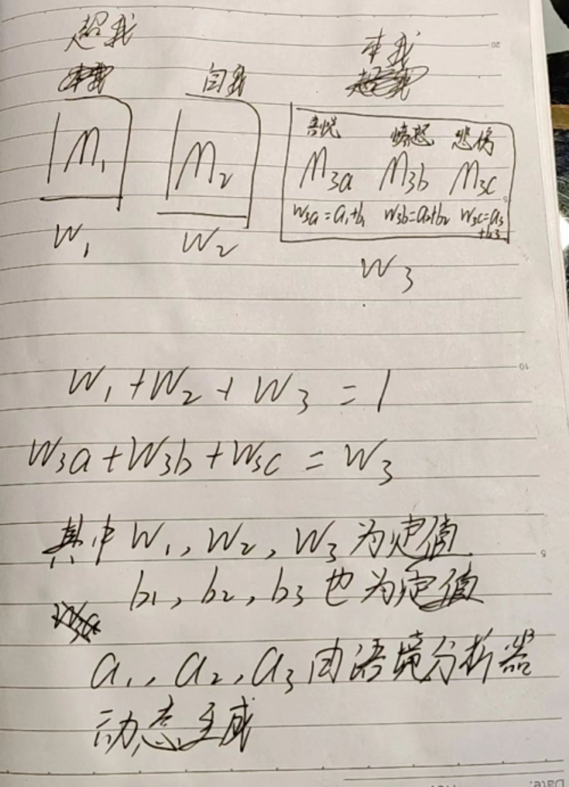

# 当AI学会“分配情绪”：一个可计算的多情感融合模型架构

> 计算机没有情感，但计算得来的情感，比猜出来的情感更可控、更可解释

注意，我的目的**不是**让AI真正拥有情感——那是不可能的。我的目的是：**把AI文本中的“情感”从模糊的、猜出来的字句模拟，变成确定性的、可分配、可计算的运算结果**。

换句话说，我想设计一个系统，其中每种情感的强度不是靠模型“即兴发挥”，而是由上游模块明确指定，然后生成过程严格遵循这个配比，输出自然流畅的混合情感文本。

---
## 灵感来源

我借鉴了心理学的“本我-自我-超我”结构，但做了工程化改造：

- **本我**：拆成几个**可计算的情感子模型**，比如喜悦模型、愤怒模型、悲伤模型。每个模型独立运行，输出对应情感的logits或特征向量——本质上是一组可量化的数值。
- **自我**：一个正常的大模型，负责生成理智、符合事实的中性回答草稿。
- **超我**：同样参与计算、混合，增强输出的正确性
- **语境分析器**：根据对话场景（工作会议 vs. 朋友闲聊）**动态计算**每种情感的权重分配，输出确定性权重向量。

## 架构设计
（2月15日半夜爬起来画的草稿。离现在很久了，现在的想法比之前的变化、完善了些）

> [!NOTE]
> **留给未来的问题**：AI指出，当前`w₃a = a₁ + b₁`的加法形式是事后为了满足归一化约束而凑出来的，缺乏事前的设计动机。`b`是子模型的性格偏置（静态），`a`是语境分析器的动态调节——这两者本质不同，直接相加会导致性格参数被语境参数轻易淹没。更合理的形式可能是乘法（如`w₃a = b₁ × (1 + a₁)`），使性格权重始终保持基础贡献，语境仅做调节。此外，最终输出是"加权混合"但具体是logits相加还是向量拼接，量纲是否统一，这些问题也需要澄清。

> [!IMPORTANT]
> 后来我自己也发现，w₃a = a₁ + b₁，w₃b = a₂ + b₂，w₃c = a₃ + b₃这个公式是后来约束而不是事先规定，我只规定了变量符合什么，却没有规定变量怎么来。先吃完再看热量，这是最大的错误

> [!IMPORTANT]
> 我自己目前对这个问题毫无头绪，我认为以自己的知识和素质无法解决这个问题。框架已经烂根了，这个方案被暂时或永久弃置

模型分为三个核心模块：超我（M₁）、自我（M₂）、本我（M₃），对应权重 w₁、w₂、w₃，满足 w₁ + w₂ + w₃ = 1。
本我（M₃）进一步拆分为三个子情绪模块：喜悦（M₃a）、愤怒（M₃b）、悲伤（M₃c），对应子权重 w₃a、w₃b、w₃c，满足 w₃a + w₃b + w₃c = w₃
子权重计算公式为：w₃a = a₁ + b₁，w₃b = a₂ + b₂，w₃c = a₃ + b₃
参数 w₁、w₂、w₃ 为定值，b₁、b₂、b₃ 为定值，a₁、a₂、a₃ 由语境分析器动态生成。其中w₁、w₂、w₃、b₁、b₂、b₃定义了模型的品质、性格等
对M₁、M₂、M₃的结果进行加权混合得到最终结果

## 语境分析器

整个系统的关键不是情感模型本身，而是**如何计算权重**。语境分析器根据对话历史输出结构化的权重：

- **时间维度**：愤怒权重随时间衰减，悲伤权重逐渐上升
- **位置维度**：不同句子由不同情感主导（例如第一句话惊讶权重高，后续转为愤怒）
- **强度维度**：正式场合对所有情感权重做整体压缩

实现建议：语境分析器可以用一个小型序列模型（LSTM或BERT）处理对话历史，输出权重序列，再经低通滤波保证平滑变化。**权重的计算是确定性的**——同样的输入必然得到同样的权重分配。

---
## 如何混合才不“精神分裂”？

最朴素的想法：让自我模型写一段中性文字，愤怒模型写一段发泄的话，然后拼接。结果可想而知——“根据天气预报，明天会下雨。我好生气啊！”这不是混合，这是人格分裂。

我们需要一种机制，让情感像“调料”一样渗透到每一个词的决策中，而不是在句子层面切换。

方案一：logits加权融合，每词受理性和情感影响。方案二：情感向量逐层调制，渗透内部表征。

---
### 方案一：在词语的“决策时刻”加权平均

> AI：“考虑在logits层面做加权平均。”

技术上说，大模型生成每个词时，会先计算一个概率分布（logits）。如果我们把自我模型和各个情感子模型的logits按**给定的权重**相加，再从中选词——

`最终logits = w_自我·logits_自我 + Σ(w_情感_i·logits_情感_i)`

这意味着**每个词的选择都同时受到理性思考和情感数值的支配**。愤怒权重高时，模型会多选“竟然、老是、烦死了”这类词；悲伤权重大时，会更倾向“唉、算了、无所谓”。

**关键技巧**：权重不要在每个token上剧烈变化。可以让语境分析器每句话输出一次权重，保持相对稳定，避免输出忽喜忽悲。

**优点**：实现简单，甚至可以用现成API的`logit_bias`参数从外部模拟。  
**缺点**：需要所有模型共用词表，权重不当可能产生病句。

### 方案二：潜在空间向量调制——“染色”

> AI：“潜在空间向量调制。”

这个方案更优雅：每个情感子模型不生成完整的句子，而是生成一个**情感向量**——可以理解为某种情绪在高维空间中的“方向”。自我模型在生成文本时，每一层的内部表征都加上这个向量的加权和，就像给黑白照片逐层上色。

**工程视角**：情感向量通过小型适配器从情感模型中提取，然后加到Transformer的某一层或所有层的hidden states上。权重直接控制每种情感向量的模长。

**优点**：情感渗透最自然，输出完全没有“拼接痕迹”。  
**缺点**：需要情感子模型输出与自我模型同维度的向量，训练更复杂。

---

### “众议院”理想 vs. 工程现实

我冒出一个更“政治化”的设想：能不能像众议院一样，自我模型先提出一个“提案”（初稿），然后喜悦、愤怒、悲伤各派代表轮流提出修改意见，最后按权重投票决定采纳哪些？

> 我描述完这个想法，AI冷静地分析了工程难点：“直接实现会遇到三个问题：冲突仲裁、离散修改难以平滑、效率太低。”
> 
> 然后它给出了四个工程上可行的近似方案。

方案A：串行局部编辑；B：并行提案仲裁；C：单模型prompt控权；D：连续空间向量辩论。

---
#### 方案A：串行修订（最简单的离散模拟）

流程：自我生成初稿 → 按权重排序，让情感子模型依次做**局部编辑**（改一个词或加一个短语）→ 后一模型看到前一修改结果 → 输出终稿。

**关键约束**：每次修改必须是最小化改动——只改语气词、标点、形容词，禁止重写整句。这样既保证情感渗透，又不破坏句法连贯。权重决定了编辑顺序和修改幅度。

#### 方案B：并行提案 + 仲裁器

所有情感子模型同时生成“修改补丁”（差异向量或替换词列表）→ 一个小型仲裁模型根据权重和语义一致性决定采纳哪些 → 合并输出。

**优点**：并行计算，效率高。  
**缺点**：需要训练仲裁器。初期可以用规则仲裁（例如权重超过0.5就强制插入一个对应的情感词）。

#### 方案C：单模型模拟多角色（最成熟，也最反直觉）

> AI说：“其实你不需要多个模型。一个足够大的模型，通过prompt就能严格遵循给定的情感权重输出文本。”
（事实上，我不是很认可。这一定程度上偏离了我的初衷）

系统指令示例：
> “你的内心有喜悦、愤怒、悲伤三种声音，当前权重分别为[0.2, 0.6, 0.2]。请生成一句话，让这些情感按权重比例自然地融合在每一处用词和语气中。不要输出‘我很愤怒’这样的直白声明，而是通过选词体现。”

从逻辑上讲，这相当于将整个“众议院”蒸馏为单一模型，权重作为条件输入。虽然失去了模块独立性，但情感混合的确定性得到了保证——输出完全由权重决定，没有额外的随机性。

**优点**：无需多模型，延迟低，输出流畅。  
**缺点**：情感混合是“模拟”而非独立计算，但对于工程目的（可分配、可计算的情感）已经足够。

#### 方案D：连续空间中的辩论

这是方案二的华丽包装——每个情感子模型生成情感向量，自我模型生成潜在表示序列，情感向量通过注意力机制加权修改这个序列，最后解码为文本。可以理解为在连续空间里完成了“辩论”与“融合”。

---

## 写在最后

这次探索让我意识到：**让AI输出带有情感的文字，不等于让AI拥有情感。** 计算机固然不懂喜怒哀乐，但正因为如此，我们才能精确地控制它输出的情感配比，而不是靠黑盒“猜”出一段可能符合用户预期的文字。
